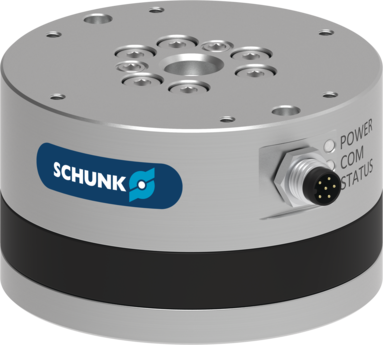

<div align="center">
  
  <h1 align="center">SCHUNK Force-Torque Sensor</h1>
</div>

<p align="center">
  <a href="https://opensource.org/licenses/gpl-license">
    
  </a>
  <a href="https://github.com/SCHUNK-SE-Co-KG/schunk_force_torque_sensor/actions">
    
  </a>
  <a href="https://github.com/SCHUNK-SE-Co-KG/schunk_force_torque_sensor/actions">
    
  </a>
  <a href="https://github.com/SCHUNK-SE-Co-KG/schunk_force_torque_sensor/actions">
    
  </a>
</p>

---

A ROS2 driver for SCHUNK force-torque sensors with configurable UDP data streaming, automatic reconnection, and lifecycle management. Works with SCHUNK FT-Sensors with Ethernet Interface Box (FTS IFB-EN Ident.-Number 1651726 or FTS IFB-EN-IP67 Ident.-Number 1651748).

## Features

- Configurable force-torque data streaming via UDP: 1000, 500, 250, 100, or 500_16 packaged mode
- Configurable UDP destination port for multi-sensor setups
- Automatic reconnection e.g. on power loss
- ROS2 lifecycle node with controlled state transitions
- Tare operations and tool settings (0-3)
- Adjustable noise filters (0-4)
- Rust-based sensor simulator for testing without hardware

## Quick Start

### For Users

#### 1. Install
```bash
source /opt/ros/humble/setup.bash
git clone https://github.com/SCHUNK-SE-Co-KG/schunk_force_torque_sensor.git src/schunk_fts
rosdep install --from-paths src --ignore-src -y
colcon build
```

#### 2. Run
```bash
source install/setup.bash
ros2 launch schunk_fts_driver driver.launch.py  # Default: 192.168.0.100
```

#### 3. Activate
```bash
ros2 lifecycle set /schunk/fts configure
ros2 lifecycle set /schunk/fts activate
ros2 topic echo /schunk/fts/data
```

### For Developers

#### Setup
```bash
curl --proto '=https' --tlsv1.2 -sSf https://sh.rustup.rs | sh  # Install Rust
pip install pytest pre-commit mypy black flake8
pre-commit install
```

#### Run Simulator
```bash
cd schunk_fts_dummy && cargo run  # Terminal 1
ros2 launch schunk_fts_driver driver.launch.py host:=127.0.0.1 port:=8082  # Terminal 2
```

#### Changing the ROS Version (Devcontainer)

The repository ships with three Dockerfiles — one per supported ROS 2 distribution:

| File | ROS 2 distro |
|------|-------------|
| `Dockerfile.humble` | Humble Hawksbill |
| `Dockerfile.jazzy` | Jazzy Jalisco |
| `Dockerfile.lyrical` | Lyrical Llama |

To switch, open [.devcontainer/devcontainer.json](.devcontainer/devcontainer.json) and change the `dockerFile` value:

```json
"dockerFile": "../Dockerfile.jazzy"
```

Then rebuild the container: **Ctrl+Shift+P → Dev Containers: Rebuild Container**.

#### Test
Tests require either a connected real sensor or a running simulator. Tests will automatically detect which is connected. Running both at the same time is not recommended. IP-addresses can be adjusted in [fixtures.py](schunk_fts_library/schunk_fts_library/fixtures.py).
```bash
pytest  # Run all tests
```

## Project Structure

```
schunk_force_torque_sensor/
├── schunk_fts_library/       # Low-level Python library
├── schunk_fts_driver/        # ROS2 lifecycle node wrapper
├── schunk_fts_interfaces/    # Custom ROS2 service definitions
└── schunk_fts_dummy/         # Rust-based sensor simulator
```

See individual package READMEs for detailed documentation:
- [schunk_fts_library](schunk_fts_library/README.md) - Library API and usage
- [schunk_fts_driver](schunk_fts_driver/README.md) - Driver configuration and services
- [schunk_fts_interfaces](schunk_fts_interfaces/readme.md) - Service interface definitions
- [schunk_fts_dummy](schunk_fts_dummy/README.md) - Simulator usage

## Common Operations

```bash
# Tare sensor
ros2 service call /schunk/fts/tare std_srvs/srv/Trigger '{}'

# Select tool setting (0-3)
ros2 service call /schunk/fts/select_tool_setting schunk_fts_interfaces/srv/SelectToolSetting '{tool_index: 0}'

# Set noise filter (0=none, 1=2x, 2=4x, 3=8x, 4=16x)
ros2 service call /schunk/fts/select_noise_filter schunk_fts_interfaces/srv/SelectNoiseFilter '{filter_number: 2}'

# Read a parameter (advanced; value is returned as a hex string)
ros2 service call /schunk/fts/get_parameter schunk_fts_interfaces/srv/GetParameter '{param_index: "0001", param_subindex: "00"}'

# Lifecycle control
ros2 lifecycle set /schunk/fts configure
ros2 lifecycle set /schunk/fts activate
```

## Troubleshooting

**Cannot connect**: Check `ping 192.168.0.100`, verify sensor is powered, check firewall (TCP:82, UDP:54843)

**Low rate**: Check CPU load, network quality, ensure driver is ACTIVE
For high-frequency RT applications, consider using an industrial Ethernet variant of the sensor.

A C++ subscriber is recommended as Python subscribers may have worse performance.

**Output rate**: The Python library accepts `output_rate` values `1000`, `500`, `250`, `100`, and `500_16`. The `500_16` setting uses the sensor's 500 Hz UDP packaged mode with 16 sequential measurements per UDP packet. In ROS, this setting changes the `/schunk/fts/data` message type from `geometry_msgs/WrenchStamped` to `schunk_fts_interfaces/WrenchStampedBatch`.

**Streaming port**: `streaming_port` is the local UDP receive port and is written to the sensor as firmware parameter `0x1033/0` during startup. Use a unique `streaming_port` per sensor.

**Wrong data**: Tare the sensor, check tool setting, verify status topic

**Build fails**: Source ROS2, run `rosdep install`, try clean build

## Topics

| Topic | Type | Description |
|-------|------|-------------|
| `/schunk/fts/data` | `geometry_msgs/WrenchStamped` for `1000`, `500`, `250`, `100`; `schunk_fts_interfaces/WrenchStampedBatch` for `500_16` | Force-torque measurements. The topic type depends on `output_rate`; `500_16` publishes one 16-sample batch per 500 Hz UDP packet. |
| `/schunk/fts/state` | `diagnostic_msgs/DiagnosticStatus` | Sensor status and diagnostics |

## Services

| Service | Type | Description |
|---------|------|-------------|
| `/schunk/fts/tare` | `std_srvs/Trigger` | Zero the sensor data|
| `/schunk/fts/reset_tare` | `std_srvs/Trigger` | Remove tare offset |
| `/schunk/fts/select_tool_setting` | `schunk_fts_interfaces/SelectToolSetting` | Select tool configuration (0-3) |
| `/schunk/fts/select_noise_filter` | `schunk_fts_interfaces/SelectNoiseFilter` | Select noise filter (0-4) |
| `/schunk/fts/send_command` | `schunk_fts_interfaces/SendCommand` | Send raw command (advanced) |
| `/schunk/fts/get_parameter` | `schunk_fts_interfaces/GetParameter` | Read sensor parameter (advanced) |
| `/schunk/fts/set_parameter` | `schunk_fts_interfaces/SetParameter` | Set sensor parameter (advanced) |

## Multiple Sensors

For multiple plain-Ethernet sensors, assign each driver instance a unique `streaming_port`. The driver configures the sensor's UDP destination port before starting the UDP stream.
For high-determinism multi-sensor applications, consider an industrial Ethernet variant such as EtherCAT or PROFINET.

## License

This project is licensed under the GNU General Public License v3.0 - see the [LICENSE](LICENSE) file for details.

## Support

[GitHub Issues](https://github.com/SCHUNK-SE-Co-KG/schunk_force_torque_sensor/issues) | SCHUNK SE & Co. KG
